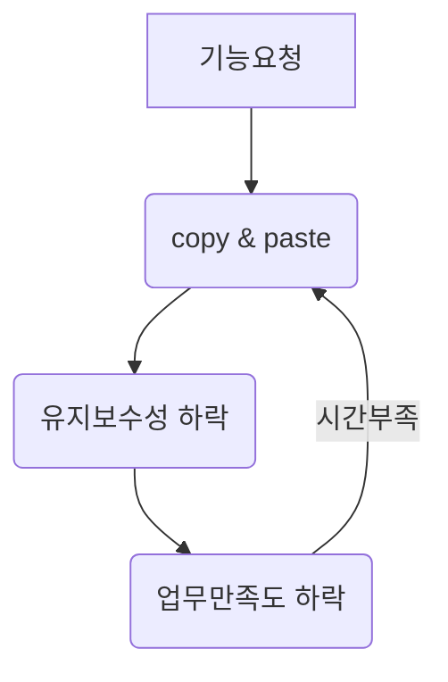

# career-architecture
> mermaid로 작성된 과제는 마크다운 파일(ARCHITECTURE.md)로 올려주시면 됩니다. (md 파일 내에 기존 구조를 넣어주세요) 
> 별도 아키택쳐나 모델링 도구를 사용한 경우에는 마크다운 파일(ARCHITECTURE.md)과 png, gif, jpg, pdf 파일 형식으로 architecture-{gitID}.png 파일명으로 upload 해주세요
# 요구사항
- [x] 담당 하는 업무에서 비효율적인 프로세스나 기술적 개선을 하고 싶은 부분의 현재 구조를 문서화 한다.
  - [x] 비효율적인 부분에 대한 분석내용을 정리한다.
  - [x] 비효율적인 부분에 대한 프로세스 또는 시스템 구조를 그려본다.

# 예시 1

## 🚀미션
- 이름 : 박세준

### 개선포인트 분석
- 현재 배포를 할 떄에는 스크립트를 통해 진행하지만, 서버간 jar파일 이동과 서버접속 등 각 스크립트들을 하나하나 실행해야한다.
- 또한 배포된 이후에 지라 혹은 슬랙에 따로 배포완료하였다고 알려야 다른 팀원들이 배포가 되었는지 알 수 있다.
- AWS code commit의 웹훅을 통해 젠킨스와 연결하고 자동 CI/CD가 되도록 설정해주며, 슬랙에 이 내용을 공유해주는 것으로 자동화해주고 싶다.

### 프로세스

