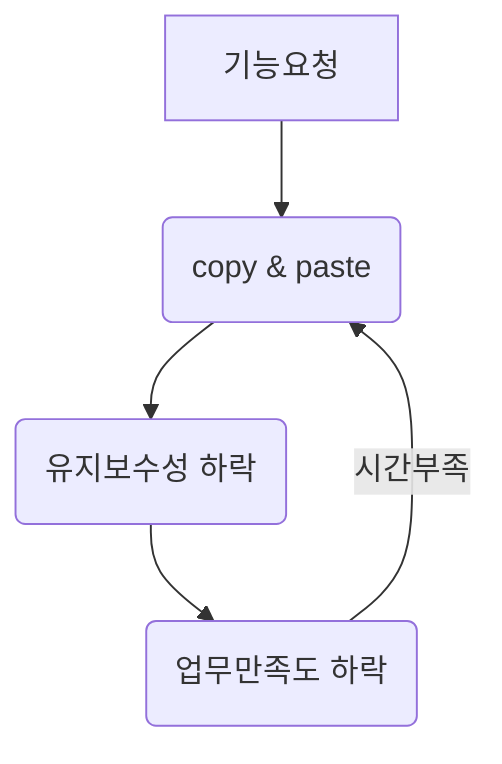

# career-architecture
> mermaid로 작성된 과제는 마크다운 파일(ARCHITECTURE.md)로 올려주시면 됩니다. (md 파일 내에 기존 구조를 넣어주세요) 
> 별도 아키택쳐나 모델링 도구를 사용한 경우에는 마크다운 파일(ARCHITECTURE.md)과 png, gif, jpg, pdf 파일 형식으로 architecture-{gitID}.png 파일명으로 upload 해주세요
# 요구사항
- [x] 담당 하는 업무에서 비효율적인 프로세스나 기술적 개선을 하고 싶은 부분의 현재 구조를 문서화 한다.
  - [x] 비효율적인 부분에 대한 분석내용을 정리한다.
  - [x] 비효율적인 부분에 대한 프로세스 또는 시스템 구조를 그려본다.
  
# 예시 2

## 🚀미션
- 이름 : 박세준

### 개선포인트 분석
- 배치를 개선하고 싶습니다.
- 현재 알림을 보내야하는 타겟을 정할떄에 모든 케이스의 잡을 테스트하기에 어려움이 있습니다.
- 이런 배치 잡을 타입별로 나눠서 작업하기 좋은 구조로 개선해주고 싶다.
- 그리고 현재 배치 테스트할떄에 dev 데이터를 받아서 처리해주고 있는데, mock 데이터 기반으로도 테스트가 되도록 개선한다. 

### 프로세스

