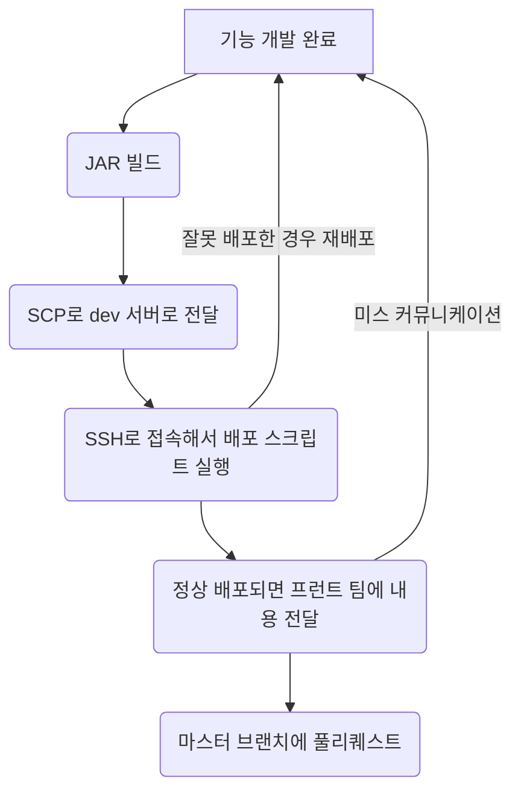

# career-architecture
> mermaid로 작성된 과제는 마크다운 파일(ARCHITECTURE.md)로 올려주시면 됩니다. (md 파일 내에 기존 구조를 넣어주세요) 
> 별도 아키택쳐나 모델링 도구를 사용한 경우에는 마크다운 파일(ARCHITECTURE.md)과 png, gif, jpg, pdf 파일 형식으로 architecture-{gitID}.png 파일명으로 upload 해주세요
# 요구사항
- [x] 담당 하는 업무에서 비효율적인 프로세스나 기술적 개선을 하고 싶은 부분의 현재 구조를 문서화 한다.
  - [x] 비효율적인 부분에 대한 분석내용을 정리한다.
  - [x] 비효율적인 부분에 대한 프로세스 또는 시스템 구조를 그려본다.

# 예시 1

## 🚀미션
- 이름 : 박세준

### 개선포인트 분석
- __현재 배포 과정__: 현재의 배포 과정은 수동으로 진행되며, 이에 따라 서버 간 파일 이동, 서버 접속, 각종 스크립트 실행 등 복잡한 단계를 거쳐야 합니다.
- __통신 및 알림의 부족__: 배포가 완료된 후, 지라나 슬랙을 통해 팀원들에게 별도로 알려야 하는 번거로움이 있습니다.
- __배포 코드의 불확실성__: 긴급한 요청으로 인해 때때로 feature 브랜치의 코드가 dev 서버에 배포되는 경우가 있어, 어떤 코드가 실제로 서버에 배포되었는지 확인하기 어렵습니다.

#### 개선 방안
- __자동 CI/CD 파이프라인 구축__: AWS CodeCommit과 Jenkins를 연동하여 코드 커밋시 자동으로 빌드 및 배포가 이루어지도록 설정합니다. 이 과정에서 빌드 및 배포의 성공 여부, 관련된 코드 변경 사항 등을 자동으로 슬랙에 통보합니다.
- __팀원들과의 투명한 커뮤니케이션 강화__: 슬랙 통합을 통해 배포 상태, 빌드 로그, 그리고 배포된 코드의 세부 사항을 실시간으로 공유함으로써, 팀원들이 언제 어떤 변경사항이 적용되었는지 쉽게 파악할 수 있게 합니다.
- __브랜치 관리의 명확화__: 배포 프로세스를 통해 어떤 브랜치의 코드가 배포되었는지 명확히 하여, 배포의 정확성을 향상시킵니다. 이는 코드의 안정성과 신뢰성을 높이는 데 기여할 것입니다.

### 프로세스

