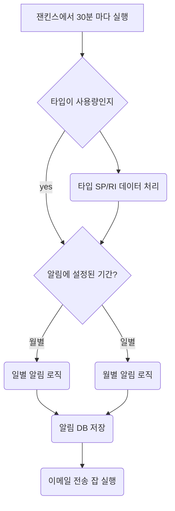

# career-architecture
> mermaid로 작성된 과제는 마크다운 파일(ARCHITECTURE.md)로 올려주시면 됩니다. (md 파일 내에 기존 구조를 넣어주세요) 
> 별도 아키택쳐나 모델링 도구를 사용한 경우에는 마크다운 파일(ARCHITECTURE.md)과 png, gif, jpg, pdf 파일 형식으로 architecture-{gitID}.png 파일명으로 upload 해주세요
# 요구사항
- [x] 담당 하는 업무에서 비효율적인 프로세스나 기술적 개선을 하고 싶은 부분의 현재 구조를 문서화 한다.
  - [x] 비효율적인 부분에 대한 분석내용을 정리한다.
  - [x] 비효율적인 부분에 대한 프로세스 또는 시스템 구조를 그려본다.
  
# 예시 2

## 🚀미션
- 이름 : 박세준

### 개선포인트 분석
- __과중한 단일 잡__: 현재 배치 잡이 너무 많은 기능을 수행하고 있으며, 다양한 타입의 알림을 한 번에 처리하고 있습니다. 이는 작성한 사람만 아는 코드가 되버립니다.
- __테스트 환경의 불안정성__: 배치 테스트는 개발(dev) 환경의 Elasticsearch 서버에 직접 요청하여 진행되고 있습니다. 이로 인해 테스트 데이터의 유무에 따라 테스트 결과가 변동되는 문제가 있습니다.
- 
#### 개선 방안 
- __잡의 세분화 및 책임 분산__: 현재 단일 잡이 수행하는 여러 기능을 분리하여 여러 개의 잡과 스텝으로 나누어 책임을 분산시킵니다.
예를 들어, 일별, 월별 알림을 처리하는 잡을 각각 분리하여, 특정 주기에 맞게 실행되도록 합니다.
- __타입별 잡 분리로 디버깅 용이성 향상__: 각 타입별로 별도의 잡을 구성함으로써 디버깅을 쉽게 할수 있도록 하고 싶습니다.
- __독립된 테스트 환경 구축__: Elasticsearch 서버에 대한 요청을 가상 데이터를 기반으로 하여, 개발 환경의 다른 서버에 영향을 주지 않는 방식으로 테스트 환경을 개선합니다.
이를 통해 테스트의 일관성과 안정성을 보장할 수 있습니다.
  
### 프로세스

